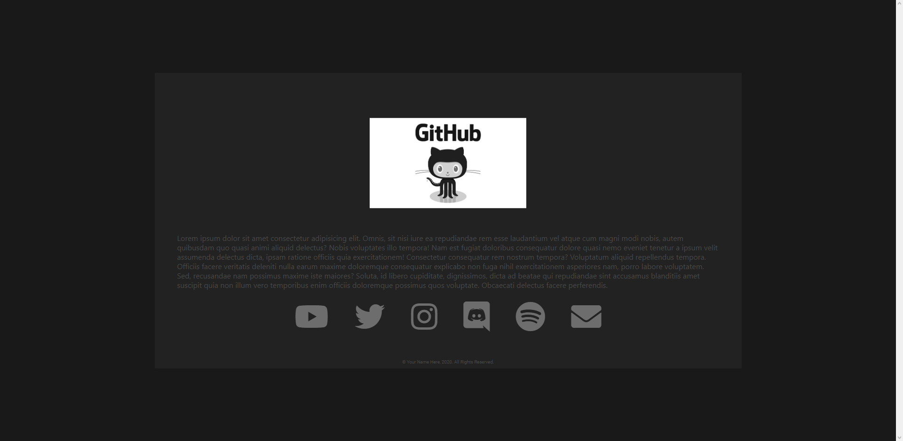
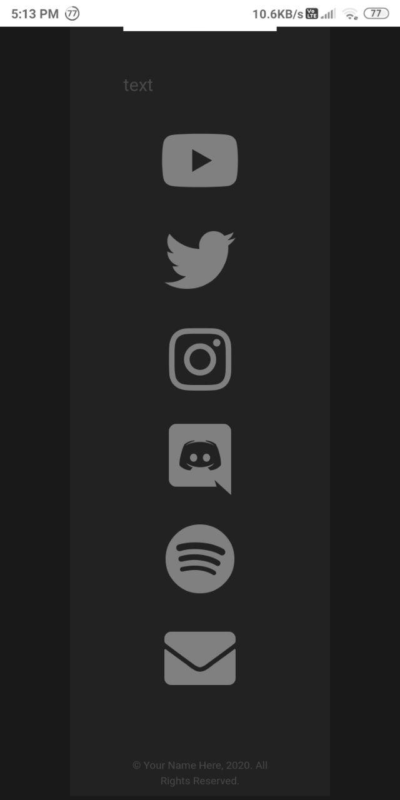

# Generic about website template

A live demo is available [here](https://alexthemaster.github.io/about-website-template/)

The template itself can be found under the src folder.

Customizability wise, you can edit the color of the icons, text and respectively the two backgrounds. This can be done by accessing the main.css file in the css folder. 

# Screenshots

